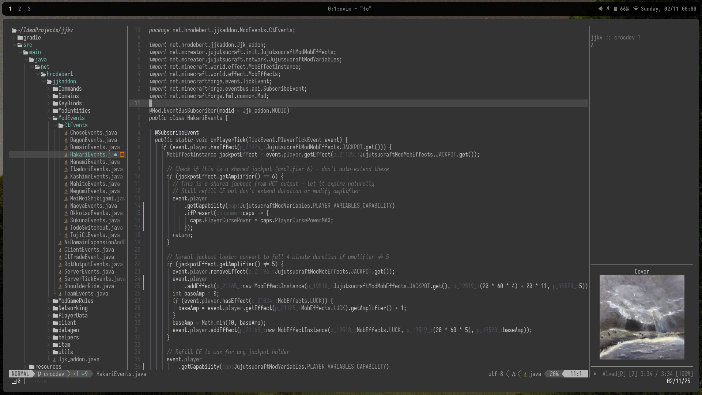
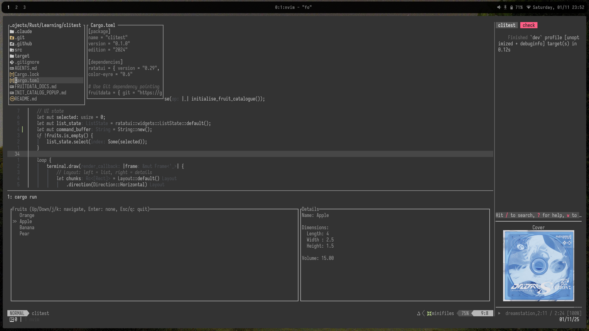

# Prototype Branch [Nightly]

 

This is a streamlined, more modern take on the original configuration, focusing on essentials with a clean, performant setup.

## Changes

- **Simplified Plugin Set** - Removed plugins, using OpenCode instead of Avante or aider
- **Lighter Footprint** - No complex RAG system, 60ms startup time
- **Modern Defaults** - Code editing, completion, debugging, and file navigation, unified under snacks, blink, etc.
